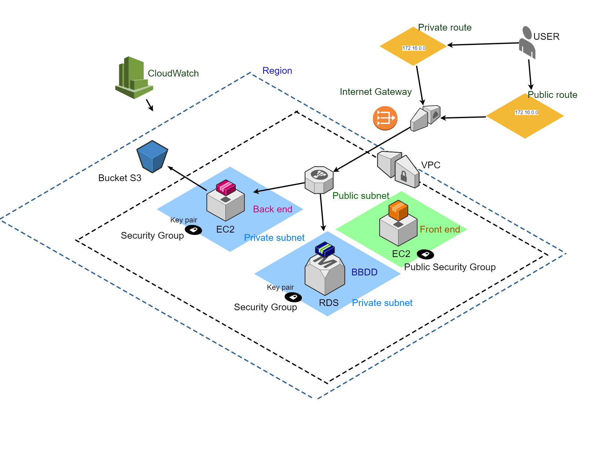

# Infraestructura - Proyecto integrador
- Gráfico
- Diseño de la red
- Documentación
- Equipo

## Gráfico de red

## Diseño de la red
 Basado en AWS, consideramos la conexión de los usuarios a nuestra app a partir de un Gateway, la creación de dos VPC que contengan los recursos del front y el back; cada una de ellas con su subnet y keypair. Además de dos grupo de seguridad (público en el caso del front y privado para el back). 
 Nos planteamos la estructa RDS para la BBDD y elementos adicionales como un loadbalancer para manejar los requerimientos del front.
 Por último, emplearemos tablas de enrutamiento, con su respectivo router para el manejo del tráfico de nuestra web. 

## Documentación
- [Regiones y Availability zones](https://docs.aws.amazon.com/AWSEC2/latest/UserGuide/using-regions-availability-zones.html)
- [VPC](https://aws.amazon.com/es/vpc/faqs/)
- [Internet gateway](https://docs.aws.amazon.com/vpc/latest/userguide/VPC_Internet_Gateway.html)
- [Security groups en AWS](https://docs.aws.amazon.com/vpc/latest/userguide/VPC_SecurityGroups.html)
- [NAT](https://docs.aws.amazon.com/es_es/vpc/latest/userguide/vpc-nat-gateway.html)
- [S3](https://aws.amazon.com/es/s3/?nc1=h_ls)
- [CloudWatch](https://aws.amazon.com/es/cloudwatch/)

### Equipo de infraestructura
- Alejandra Marín
- Indira Valentina Réquiz
