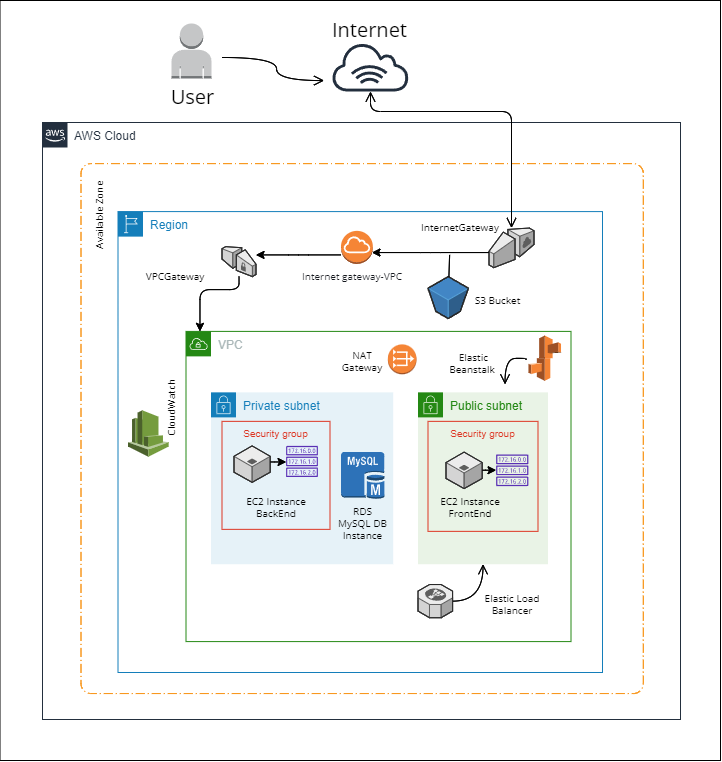

# Infraestructura - Proyecto integrador
- Gráfico
- Diseño de la red
- Documentación
- Equipo

## Gráfico

## Diseño de la red
Se establece como entorno de trabajo el servicio AWS. Así mismo, se encapsulan todos los recursos dentro de una **zona de diponibilidad**; y a su vez, de una **región** donde serán instalados.
Teniendo en cuenta el objetivo de la aplicación, se agregan los siguientes recursos:
Una **VPC** que va a contener dos subnets, una pública y una privada. Las subnet serán las encargadas de asignar las direcciones IP en la VPC que se va a asociar con los demás recursos. La conexión a la VPC será a través de un **Internet Gateway**, que es el que va a permitir a los usuarios a través de Internet conectarse a nuestra aplicación.
La **subnet privada** contara con su respectivo **grupo de seguridad** y contendrá los recursos relacionados al Back End y Base de Datos, en este caso, una **instancia EC2**, con su respectivo par de llaves, así como también una **instancia RDS** que se encargará de manejar la base de datos, la cual será en MySQL. Además, se usa un **NAT Gateway**, en caso que se requiera conectar con servicios fuera de nuestra VPC (serivios externos que no pueden tener conexión con las instancias privadas).
La **subnet pública** también tendrá su propio **grupo de seguridad** y contendrá los recursos relacionados al Front End, es decir, una **instancia EC2**.
Ambos grupos de seguridad (privado y público) actuán como firewall virtual y controlan el tráfico entrante y saliente de las instancias.
Así mismo, ambas subnet contienen **tablas de enrutamiento**, ya que son estás las que especifican cómo dirigir el tráfico de red desde dentro de la subnet.

Por otra parte, en lo que concierne al Front End, se asocia el PaaS **Elastic Beanstalk**, ya que le daría soporte a nuestra aplicación. Es decir, manejaría los detalles de aprivisionamiento de capacidad, escalamiento, supervisión del estado de la aplicación y _load balancing_.

Referente al Monitoreo, se implementaría **CloudWatch**, el cual arrojará alarmas de acuerdo a las métricas que deseemos analizar.
Finalmente, se agrega un **S3 Bucket**, el cual almacenaría el código fuente, logs entre otros artefactos. 

## Documentación
- [Regiones y Availability zones](https://docs.aws.amazon.com/AWSEC2/latest/UserGuide/using-regions-availability-zones.html)
- [VPC](https://aws.amazon.com/es/vpc/faqs/)
- [Internet gateway](https://docs.aws.amazon.com/vpc/latest/userguide/VPC_Internet_Gateway.html)
- [Security groups en AWS](https://docs.aws.amazon.com/vpc/latest/userguide/VPC_SecurityGroups.html)
- [NAT](https://docs.aws.amazon.com/es_es/vpc/latest/userguide/vpc-nat-gateway.html)
- [S3](https://aws.amazon.com/es/s3/?nc1=h_ls)
- [CloudWatch](https://aws.amazon.com/es/cloudwatch/)

### Equipo
- Alejandra Marín
- Indira Valentina Réquiz